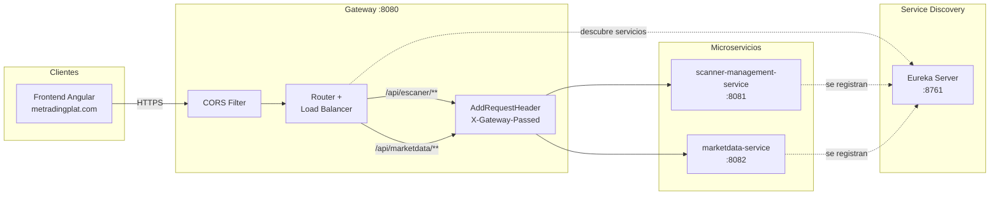
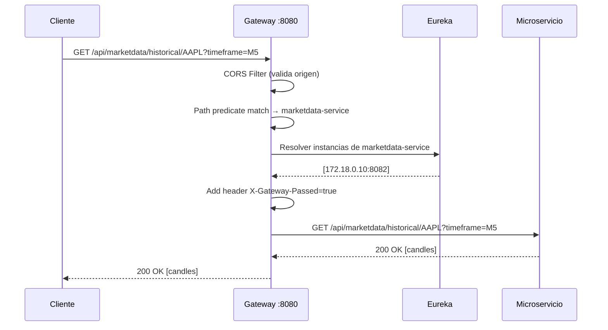

# Gateway

API Gateway de la plataforma **MeTradingPlat**. Punto de entrada unico para todos los microservicios, basado en Spring Cloud Gateway con descubrimiento de servicios via Eureka.

## Tabla de Contenido

- [Arquitectura](#arquitectura)
- [Tecnologias](#tecnologias)
- [Enrutamiento](#enrutamiento)
- [CORS](#cors)
- [Configuracion](#configuracion)
- [Ejecucion](#ejecucion)
- [CI/CD](#cicd)

## Arquitectura



### Flujo de una peticion



## Tecnologias

| Tecnologia | Version | Proposito |
|---|---|---|
| Java | 21 | Runtime (Virtual Threads) |
| Spring Boot | 3.5.9 | Framework |
| Spring Cloud Gateway | 2025.0.0 | Enrutamiento reactivo (WebFlux/Netty) |
| Spring Cloud LoadBalancer | - | Balanceo de carga client-side |
| Eureka Client | - | Descubrimiento de servicios |
| Docker | Multi-stage | Contenedorizacion |

## Enrutamiento

### Rutas Estaticas

| ID | Path | Servicio destino | Filtros |
|---|---|---|---|
| `scanner-management-service` | `/api/escaner/**` | `lb://scanner-management-service` | `AddRequestHeader=X-Gateway-Passed,true` |
| `marketdata-service` | `/api/marketdata/**`, `/api/test/**` | `lb://marketdata-service` | `AddRequestHeader=X-Gateway-Passed,true` |

- `lb://` indica balanceo de carga via Eureka
- El header `X-Gateway-Passed: true` permite a los microservicios verificar que la peticion paso por el gateway

### Auto-Discovery

```yaml
discovery:
  locator:
    enabled: true
    lower-case-service-id: true
```

Cualquier servicio registrado en Eureka es accesible automaticamente via `/{service-name}/**`.

## CORS

Configuracion centralizada en `CorsConfig.java`:

| Propiedad | Valor |
|---|---|
| **Origenes permitidos** | `https://metradingplat.com`, `https://www.metradingplat.com` |
| **Metodos HTTP** | GET, POST, PUT, DELETE, OPTIONS, PATCH |
| **Headers permitidos** | Todos (`*`) |
| **Headers expuestos** | Authorization, Content-Type |
| **Credenciales** | Habilitadas |
| **Cache preflight** | 1 hora (3600s) |

## Configuracion

### Variables de Entorno

| Variable | Descripcion | Default |
|---|---|---|
| `EUREKA_HOST` | Host del servidor Eureka | `directory` |
| `SPRING_PROFILES_ACTIVE` | Perfil activo | `prod` |

### Perfiles

- **dev**: Eureka en `localhost:8761`
- **prod**: Eureka via `${EUREKA_HOST}:8761`, forward-headers-strategy: native

### Actuator

Endpoints expuestos: `/actuator/health`, `/actuator/info`

## Ejecucion

### Con Docker Compose

```bash
# Desde la raiz de metradingplat/
docker compose up -d gateway
```

Disponible en `http://localhost:8080`.

### Desarrollo Local

```bash
cd gateway

# Requiere Java 21, Maven, Eureka corriendo en localhost:8761
mvn spring-boot:run -Dspring-boot.run.profiles=dev
```

## CI/CD

Pipeline automatizado con GitHub Actions:

### CI (push a master)

1. Checkout + JDK 21
2. Build con Maven (`mvn clean package -DskipTests`)
3. Build imagen Docker: `virtud142/metradingplat_gateway:latest`
4. Push a DockerHub

### CD (tras CI exitoso)

1. Pull imagen en servidor self-hosted
2. Stop/remove contenedor anterior
3. Run nuevo contenedor en red `metradingplat-network`
4. Verificacion de salud

```
Docker Registry: virtud142/metradingplat_gateway:latest
```
